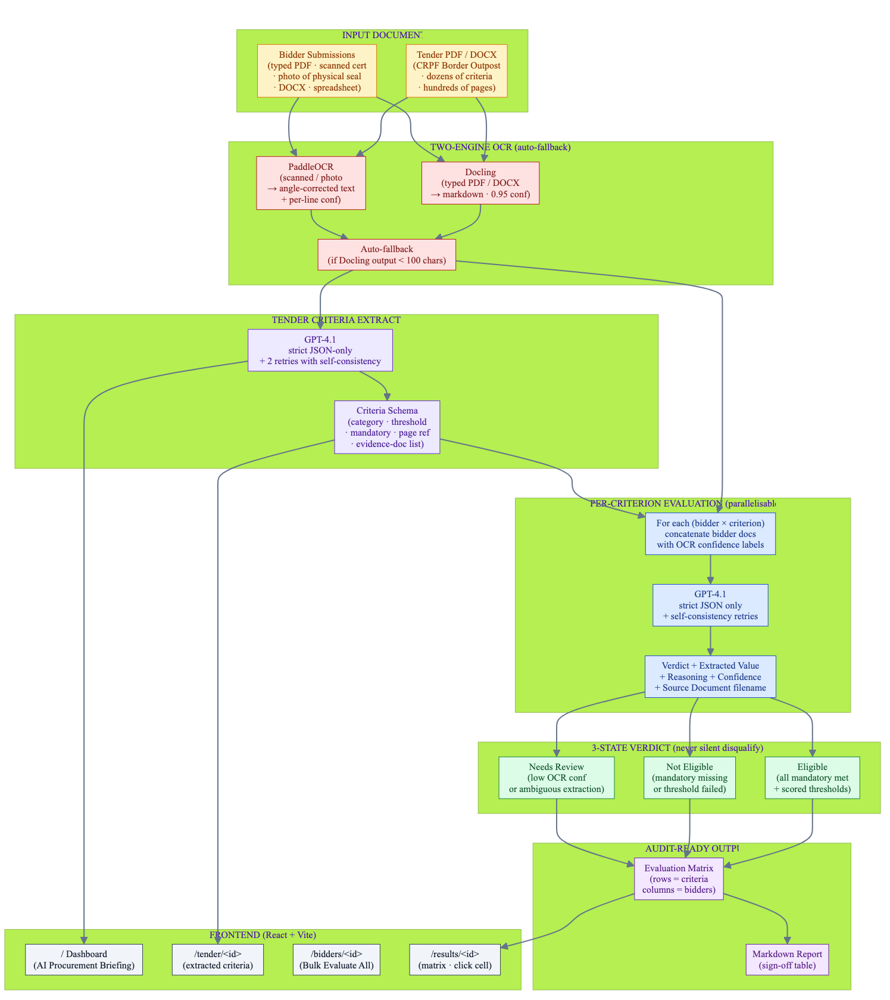

# TenderEval AI — AI-Based Tender Evaluation & Eligibility Analysis for CRPF

> **PanIIT AI for Bharat 2026 — Theme 3** · **Sponsor:** Central Reserve Police Force (CRPF)
> Extract · Match · Explain

▶ **[Watch the 5-minute demo](https://youtu.be/bvTZqsL4uLE)**

---

## What it solves

Government tender evaluation today is manual, inconsistent, and hard to audit. A typical CRPF tender has dozens of eligibility criteria across hundreds of pages, with bidders submitting hundreds more pages each — typed PDFs, scanned certificates, photographs of physical seals. Committees spend days cross-checking, two evaluators reach different conclusions on the same documents, and audit trails are weak. TenderEval AI does it in minutes, consistently, and audit-ready — and **never silently disqualifies**.

## Key features

- **Tender criteria extraction** — Docling for typed PDFs, PaddleOCR fallback for scans. GPT-4.1 extracts JSON: category + threshold + mandatory + page reference + evidence-doc list
- **Heterogeneous bidder doc parsing** — Same two-engine OCR strategy with per-line confidence aggregation
- **Per-criterion evaluation** — Strict JSON-only prompt, 2 retries with self-consistency. Verdict + extracted value + reasoning + confidence + source-document filename
- **Three-state verdict** — **Eligible** / **Not Eligible** / **Needs Review** — ambiguous cases never silently disqualified
- **Bulk Evaluate All Bidders** — One click runs the full evaluation panel
- **Audit-ready export** — Markdown report with sign-off table
- **AI Procurement Briefing** — Dashboard summary in plain English

## Architecture



> Source: [`docs/diagrams/architecture.mmd`](docs/diagrams/architecture.mmd) (Mermaid)

## Quick start

### Prerequisites

| Tool | Version |
|------|---------|
| Python | 3.11+ |
| Node.js | 18+ |
| npm | 9+ |

### Backend (FastAPI on port 8000)

```bash
cd backend
python3 -m venv .venv
source .venv/bin/activate         # Windows: .venv\Scripts\activate
pip install -r requirements.txt

# Configure env (optional — without keys, AI falls back to deterministic templates)
cat > .env.local <<'EOF'
AZURE_OPENAI_API_KEY=your_key
AZURE_OPENAI_ENDPOINT=https://<resource>.openai.azure.com/openai/deployments/<deployment>/chat/completions?api-version=2025-01-01-preview
EOF

# Seed demo data + run
python ../demo/seed_demo.py
uvicorn main:app --port 8000 --reload
```

Backend on <http://127.0.0.1:8000>. OpenAPI docs at `/docs`.

### Frontend (Vite on port 5173)

```bash
cd frontend
npm install
npm run dev
```

Frontend on <http://localhost:5173> (proxies `/api` → backend port 8000).


## Demo flow

1. Land on `/` for the **AI Procurement Briefing** + KPI strip + verdict mix
2. Tender detail (Border Outpost — CRPF 2026-BOP-047) — 8 criteria across eligibility / technical / financial
3. `/bidders/<tenderId>` — 3 bidders with per-document OCR confidence. Click **Evaluate All Bidders**
4. `/results/<tenderId>` — Infra Build 100% Eligible · QuickBuild 38% Not Eligible · Bharat Nirman 63% **Needs Review**
5. Click any cell → reasoning + extracted value + source document
6. Click **Export Audit Report** → markdown sign-off table

> **Demo data:** 1 CRPF tender (Construction of Border Outpost — 2026-BOP-047) · 8 criteria · 3 bidders covering all three verdict types · 24 (bidder × criterion) evaluation pairs

## Tech stack

| Layer | Technology |
|-------|------------|
| Backend | FastAPI + SQLAlchemy 2 + SQLite (PostgreSQL-portable) |
| Frontend | React 18 + Vite + TypeScript + Tailwind |
| Document parsing | Docling (typed PDF/DOCX) → PaddleOCR (scanned/photos), automatic fallback |
| AI / LLM | Azure OpenAI GPT-4.1 (fully optional with deterministic fallback) |

## Brief non-negotiables met

- ✅ Every verdict explainable at the criterion level
- ✅ Ambiguous cases surfaced (never silent reject — the brief's most important rule)
- ✅ Scanned + photograph OCR support
- ✅ Audit-ready end-to-end
- ✅ Synthetic data only · no hosted-LLM on raw PII

---

## Submission

- **Hackathon:** PanIIT AI for Bharat 2026
- **Theme:** 3 — AI-Based Tender Evaluation & Eligibility Analysis for CRPF
- **Video:** https://youtu.be/bvTZqsL4uLE
- **Repo:** https://github.com/sridhar7601/tendereval-ai
- **Team:** Sridhar Suresh, Sruthi Krishnakumar
